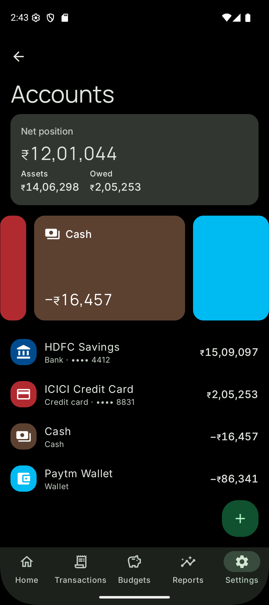
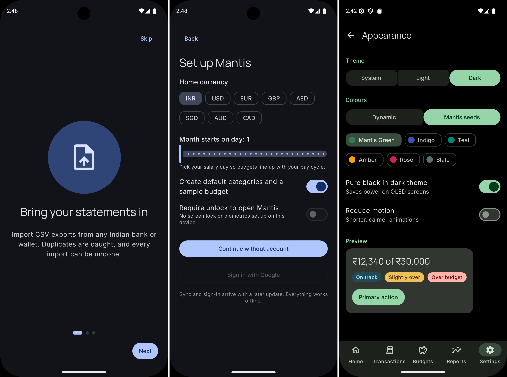
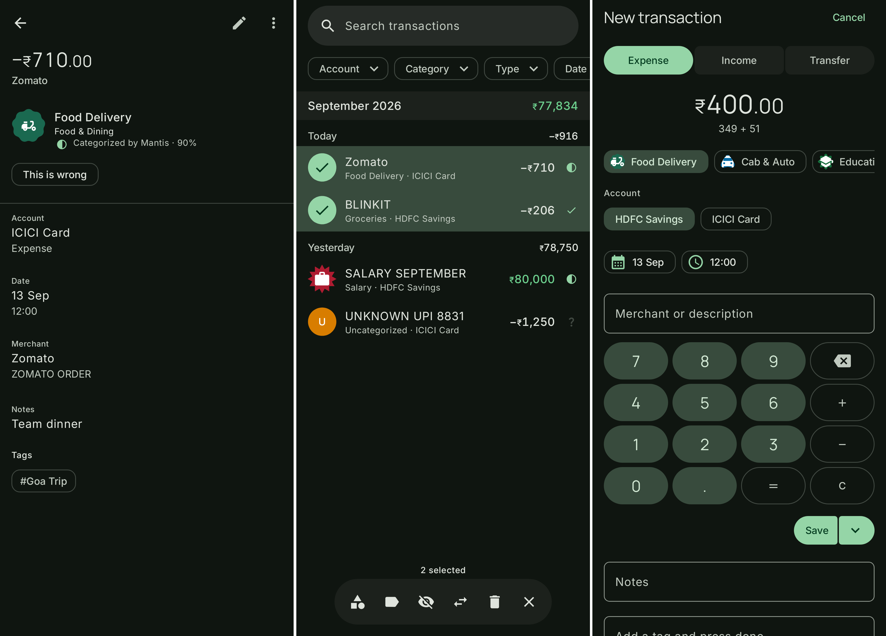

# Mantis

Local-first, privacy-first personal finance for Android. Native Kotlin + Jetpack Compose with Material 3 Expressive.

<p align="center">
  
  
  
</p>

- **Import bank statements** (CSV, Indian bank presets + mapping wizard) and add expenses in two taps.
- **On-device auto-categorization** — a ≤ 2 MB LiteRT classifier reads raw UPI/POS/NEFT narrations (`UPI-SWIGGY-…` → *Food Delivery*) offline, with calibrated confidence and a review queue; learns from every correction.
- **Forward-looking budgets** — month-end projection per category, offline threshold alerts before a budget is blown.
- **Insights** — subscriptions, price hikes, duplicate charges, unusual spend, month-over-month shifts.
- **Custom views** — group any period by category, item type, merchant, tag, month/year and more; saved, pinnable views.
- **Receipt scanning** (v1.1) — on-device OCR → line items → per-item categories as splits, reconciled with the bank transaction.
- **Bring-your-own AI** — optional long-tail categorization and a chat assistant using *your* Anthropic/OpenAI/Gemini key, your own Ollama/LM Studio server, or a model running on the phone. Off by default; keys stay on the device; no Mantis server ever sees a prompt.
- **Phone-assistant integration** (Android 16+) — "add a ₹300 grocery expense" via AppFunctions, with tiered consent and a full activity log.
- **Optional account** — Google sign-in for multi-device sync and statistical forecasting; the app is complete without it.

## Repository layout
```
.                 Android app (multi-module Gradle, Kotlin DSL)
├── app/          application module
├── core/         common, model, domain, data, database, ml, llm, receipts, designsystem, …
├── feature/      onboarding, home, transactions, import, budgets, reports, assistant, …
├── appfunctions/ Android 16 AppFunctions service
├── backend/      FastAPI service (sync, forecasting, model registry) — optional
└── ml/           model training, export and evaluation harness
```

## Build
Android Studio (latest stable), JDK 21, Android SDK Platform 37. Open the repository root; run the `app` configuration on an API 28+ device or emulator.

## Status
Pre-alpha — under active development.

## Licence
Apache-2.0
